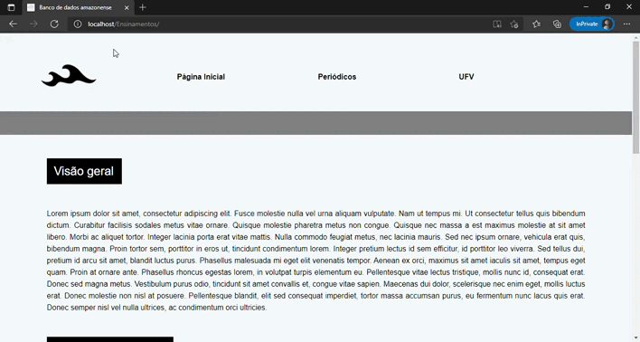
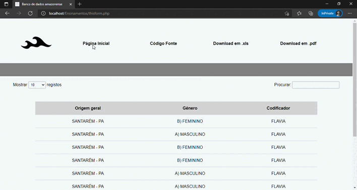
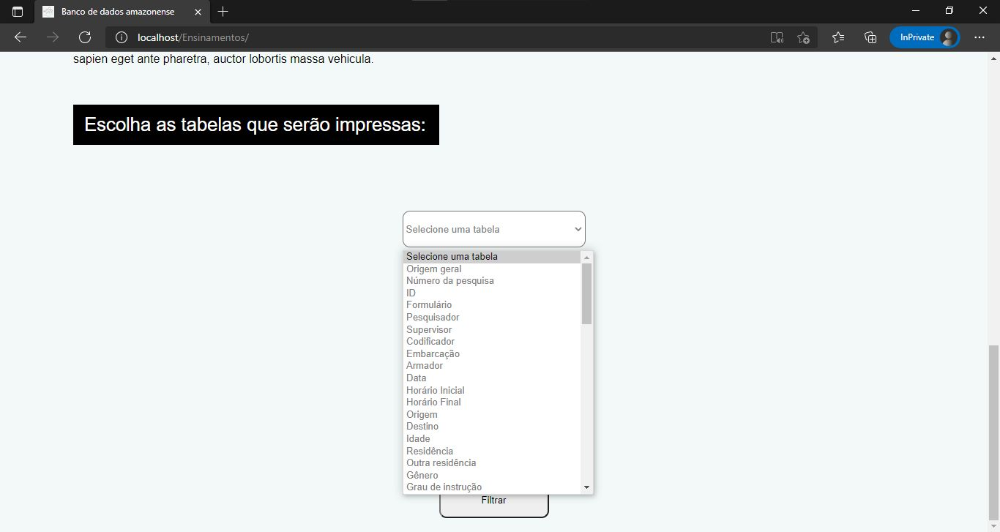

# Banco de dados amazonense

Site que tem como objetivo disponibilizar, de maneira interativa, as informações hidroviárias do estado do Amazonas.

Para a construção do site utilizou-se as linguagens PHP, HTML, CSS e JavaScript. O HTML realizou o esqueleto da página e o CSS a estética do mesmo, já o PHP e o JavaScript serviram para formulários e dinamização da página. A linguagem PHP foi muito importante para estabelecer a conexão entre o banco de dados, definido na linguagem SQL, e o formulário da página inicial.

 Para que todas as funcionalidades da página aconteçam da melhor forma possível foi necessário a utilização do dompdf para formatar a impressão de tabelas disponibilizadas pela página. 

--------

- Página Inicial*

##

  

##

- Após a escolha das tabelas*

##

  

--------

*Nota: A janela aberta na caixa de opção não aparece devido a gravação

##

  

